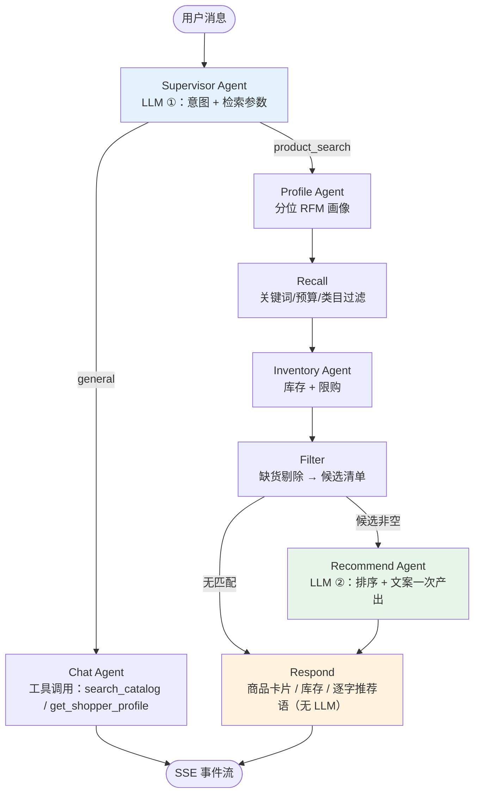

# Multi-Agent Shopping Assistant

基于 **LangGraph** 的多 Agent 电商导购系统：Supervisor 用 LLM 解析每个请求的意图与检索参数，画像、召回、库存、精排+文案各司其职，全部过程通过 SSE 实时推送到前端仪表盘。后端 FastAPI，前端 React 19 + TypeScript。

## 亮点

- **每轮只花 2 次 LLM 调用**：查询理解 1 次，排序 + 文案合并 1 次；召回、库存、过滤、回复组装全是确定性代码，实测 0 ms
- **混合召回**：关键词召回 + **本地 ONNX 语义向量召回**（`bge-small-zh-v1.5`，用 RRF 融合）。无需 torch（约 2 GB）、无需 embedding API，完全离线；实测「夏天穿的连衣裙」「卧室香薰」这类自然语言都能命中
- **硬约束不妥协**：预算 / 类目 / 品牌是过滤器，**永不为了让列表非空而放宽**；确实无合适商品时由排序模型返回空列表，前端提示「没有符合条件的商品」
- **意图路由**：Supervisor 判断是购物咨询还是通用问答，后者走独立的 tool-calling Agent（`search_catalog` / `get_shopper_profile`）
- **全程实时流**：Agent 状态、商品卡片、库存、逐字回复都以事件流推送，前端三栏同步刷新
- **对话记忆**：LangGraph Checkpointer 按 `thread_id` 保存上下文，支持「便宜点的」「那白色的呢」这类追问
- **跨服务商的结构化输出**：`JsonStructured`（JSON 模式 + schema 注入），同时兼容 OpenAI 与 DeepSeek thinking 模型
- **稳健性**：每个 Agent 独立超时熔断、指数退避重试、失败降级（排序挂了就按召回顺序继续）；硬约束（预算/类目）永不为了让列表非空而放宽
- **A/B 测试**：一致性哈希分桶 + Thompson Sampling 动态调权
- **中英双语**：右上角一键切换，界面文案、商品类目/标签、LLM 回复语言同步切换；支持 `?lang=zh` 链接直达

## 界面布局

三栏实时仪表盘：

| 区域 | 内容 |
|------|------|
| 左栏 | 4 个 Agent 状态卡片（空闲 / 运行中 / 完成）+ 技术栈 |
| 中栏 | 对话流：Supervisor 回复、商品卡片（Best Match / High Rated / Great Value）、库存徽章、逐字流式推荐语；底部输入框 + SSE 连接状态 |
| 右栏 | 用户画像（VIP、RFM Segment、R/F/M 数值）、RFM 客群聚类、A/B 实验面板（转化率 + Winner）、响应耗时（含各 Agent 分解） |

## 系统架构



### 为什么只有两次 LLM 调用

画像、召回、库存、过滤、组装回复都不需要模型，实测每项 0.0–1.4 ms，而一次 LLM 调用是 1–2 s，所以把它们拆成独立节点不会更快。排序和写推荐语输入相同、只差产出内容，因此合并进同一次结构化调用。

> 注意：LangGraph 里一个有多条不同层级入边的节点会**每个 superstep 执行一次**。把 `profile → filter` 与 `inventory → filter` 分开连（`inventory` 比 `profile` 晚一个 superstep 完成）会让下游 LLM 调用静默翻倍；现为单链，`tests/test_graph.py::test_a_shopping_turn_costs_exactly_two_llm_calls` 守住这一点。

## Agent 一览

| Agent | 类型 | 职责 | 实现 |
|-------|------|------|------|
| `SupervisorAgent` | LLM 结构化输出 | 意图路由 + 检索参数抽取 | `agents/supervisor_agent.py` |
| `UserProfileAgent` | 确定性计算 | 分位 RFM 打分 + 客群分类 | `agents/user_profile_agent.py` |
| `ProductRecAgent` | 规则召回 + LLM | 目录召回，以及排序 + 文案（一次调用） | `agents/product_rec_agent.py` |
| `InventoryAgent` | 确定性计算 | 缺货过滤、低库存预警、限购 | `agents/inventory_agent.py` |
| `ChatAgent` | LLM 工具调用 | 通用问答（目录/画像工具） | `agents/chat_agent.py` |

## 快速开始

### 环境要求

- Python 3.12+
- Node.js 20+
- 任意 OpenAI 兼容 LLM 接口的 API Key

### 1. 后端

```bash
cd python

conda create -n agent python=3.12 -y
conda activate agent
pip install -r requirements-dev.txt   # 含 pytest

cp .env.example .env
# 编辑 .env，填入 API Key / 服务地址 / 模型名

# 拉取 ShopSimulator 真实商品与用户画像（约 27 MB，未执行则自动回落内置演示数据）
python scripts/fetch_data.py
python scripts/build_index.py         # 语义召回索引（首次会自动下载约 24 MB 模型）

python main.py                        # http://localhost:8000
```

> **DeepSeek 用户**：thinking 模型会拖慢结构化调用（实测 10s → 1.4s）且不支持强制 tool_choice，
> 请在 `.env` 中设置 `ECOM_LLM_DISABLE_THINKING=true`，项目会自动关闭隐藏推理。

### 2. 前端

```bash
cd frontend
npm install
npm run dev                           # http://localhost:5173
```

浏览器打开 http://localhost:5173 ，试试输入 `推荐一款 300 元以内的保湿护肤品`。

### 3. 测试

16 个单元测试与集成测试全部使用桩 LLM，不需要 API Key（固定跑内置演示数据）：

```bash
cd python
pytest tests/ -v
```

### 4. Docker

```bash
export ECOM_LLM_API_KEY=你的密钥
docker compose up -d                  # API: http://localhost:8000
```

## API

| 方法 | 路径 | 说明 |
|------|------|------|
| GET | `/health` | 健康检查 |
| POST | `/api/v1/chat` | 聊天入口，SSE 事件流（`language`: `en` \| `zh`） |
| POST | `/api/v1/recommend` | 非流式推荐（Swagger / API 客户端） |
| GET | `/api/v1/users` | 演示用户列表 |
| GET | `/api/v1/users/{user_id}/profile` | 用户画像 + RFM |
| GET | `/api/v1/experiments?user_id=` | A/B 实验状态 |
| POST | `/api/v1/experiments/outcome` | 记录实验转化（更新 Thompson 后验） |

### SSE 事件

| 事件 | 载荷 | 前端表现 |
|------|------|----------|
| `session` | `thread_id` | 保存会话，后续追问复用 |
| `agent` | `agent`, `status`, `message` | 左栏状态灯 / 聊天内的 Agent 状态 |
| `plan` | `intent`, `reply`, `agents`, … | Supervisor 气泡 + 本轮调度计划 |
| `experiment` | `variant`, `variants[]`, `winner` | 右栏 A/B 面板 |
| `profile` | 用户画像对象 | 右栏画像 + RFM 面板 |
| `products` | 商品列表 | 商品卡片（自动打徽章） |
| `marketing` | 文案条目 + 客群 | Copywriting Agent 气泡 |
| `inventory` | 库存条目 + 摘要 | Inventory Agent 气泡 + 库存徽章 |
| `token` | `content` | 逐字流式回复 |
| `done` | `latency_ms`, `timings` | 响应耗时卡片 |
| `error` | `message` | 错误气泡 |

## 配置

`.env`（前缀 `ECOM_`）：

| 变量 | 默认值 | 说明 |
|------|--------|------|
| `ECOM_LLM_API_KEY` | — | 必填 |
| `ECOM_LLM_BASE_URL` | `https://api.openai.com/v1` | 任意 OpenAI 兼容地址 |
| `ECOM_LLM_MODEL` | `gpt-4o-mini` | 模型名 |
| `ECOM_LLM_DISABLE_THINKING` | `false` | DeepSeek thinking 模型建议开启 |
| `ECOM_MAX_PRODUCTS` | `3` | 聚合后展示的商品数 |
| `ECOM_MAX_CANDIDATES` | `12` | 召回候选上限 |
| `ECOM_DATA_SOURCE` | `auto` | `auto` / `real` / `mock`，见下方「数据来源」 |
| `ECOM_CURRENCY` | `CNY` | 目录货币（ISO 代码），同时驱动界面价格符号与提示词 |

可选接入 LangSmith 追踪：设置 `LANGSMITH_TRACING=true` 与 `LANGSMITH_API_KEY`。

## 项目结构

```text
.
├── python/
│   ├── main.py                     # FastAPI 入口 + SSE 适配器
│   ├── orchestrator/graph.py       # LangGraph 状态图（核心编排）
│   ├── agents/
│   │   ├── supervisor_agent.py     # LLM 计划与路由
│   │   ├── user_profile_agent.py   # 分位 RFM 画像
│   │   ├── product_rec_agent.py    # 召回 + 排序/文案（一次调用）
│   │   ├── inventory_agent.py      # 库存决策
│   │   ├── chat_agent.py           # 工具调用助手
│   │   ├── structured.py           # 跨服务商结构化输出
│   │   ├── models.py               # ChatOpenAI 工厂
│   │   └── base_agent.py           # 超时 / 重试 / 降级基类
│   ├── data/                       # 商品目录与用户（含生成的向量索引）
│   ├── services/ab_test.py         # A/B + Thompson Sampling
│   ├── services/embeddings.py      # 本地 ONNX 文本向量（无需 torch）
│   ├── services/vector_index.py    # 目录向量索引 + 余弦检索
│   ├── scripts/fetch_data.py       # 下载并转换 ShopSimulator 数据
│   ├── scripts/build_index.py      # 构建语义召回索引
│   ├── models/schemas.py           # Pydantic 模型
│   ├── config/settings.py          # 环境配置
│   └── tests/                      # 15 个测试（桩 LLM）
├── frontend/
│   └── src/
│       ├── hooks/useAgentStream.ts # SSE 连接与全局状态
│       ├── components/             # 三栏布局的所有组件
│       ├── api.ts, types.ts
│       └── index.css               # Tailwind 主题
├── docs/architecture.md            # 架构与协议详解
└── docker-compose.yml
```

## 数据来源

### 真实数据（推荐）

```bash
cd python
python scripts/fetch_data.py                 # 完整库 23,421 条，约 24 MB，镜像自动回退
python scripts/fetch_data.py --source hf     # 强制走 HF（同一份数据，~104 MB jsonl）
```

自 [ShopSimulator](https://github.com/ShopAgent-Team/ShopSimulator)（arXiv 2601.18225）转换而来。上游把同一份目录打成两种包：环境仓库里是 24 MB 的 gz 数组，HF 上是 104 MB 的 JSON Lines，**内容相同**（实测都是 23,421 条记录）。

- **商品**：真实中文电商商品（标题、三级类目、店铺、CNY 价格、属性标签、SKU、图片 URL），9 个一级类目，23,315 件通过价格清洗
- **用户**：其中 4,666 条带 `user_persona`（4,009 个唯一用户），含会员等级、近 90 天订单数、近 30 天消费额、复购率、类目/品牌偏好、价格区间、14 天搜索词与收藏加购记录

> 只要 persona 分片（4,638 件商品）的话，用它当 `--files` 即可，但那些记录本来就是完整库的子集，没有理由这么取。

上游数据集**没有 license**，因此数据不入库：`python/data/raw/` 与 `python/data/generated/` 已在 `.gitignore` 中，clone 后需自行执行脚本。

商品缺少评分、评价数与库存，这三项由 asin 的确定性哈希**合成**（保证同商品永远同值），代码中标注为 SYNTHETIC；`recency_days` 同样由复购率推导，因数据集不含「距上次购买天数」。

## 语义召回

```bash
cd python
python scripts/build_index.py            # 23315 件约 67s；首次会下载约 24 MB 模型
```

- 模型：`BAAI/bge-small-zh-v1.5` 的 int8 ONNX 版本，跑在 `onnxruntime` 上——**不需要 torch**，也不需要 embedding API
- 索引：`data/generated/embeddings.npy`（512 维，L2 归一化，点积即余弦）；文件被 gitignore，模型在 `data/models/`
- 检索：关键词与向量两路各自排序，用 **RRF** 融合（比标定「关键词分」与「余弦相似度」的权重稳得多）
- 约束：硬过滤先算好合规商品集合，**向量检索与排序都只在该集合内进行**（子集矩阵乘，所以预算/类目越窄越快），最后在 `recall_products` 出口再校验一次
- 降级：索引缺失、商品目录变化（id 对不上）或模型未下载时，自动回落纯关键词召回，不会报错
- 速度：召回中位 **7–9 ms**（带预算/类目过滤时）到 34 ms（全库无过滤），相对秒级的 LLM 调用可忽略

### 一个实测无效的做法

本来想用「余弦相似度低于阈值就算无匹配」，在真实目录上标定后发现**不可行**：应命中的查询 top-1 最低 0.600，应不命中的最高 0.602，两类几乎完全重叠；换成相对分布（z 分数）也一样（3.85–4.84 vs 3.02–5.39）。所以没有采用相似度阈值，而是让排序模型在候选都不合适时返回空列表——已实测生效（「想买一双 1 元以内的跑鞋」「我要买一架私人飞机」都正确判空）。

### 内置演示数据（回落）

未执行下载脚本时自动使用，保证仓库 clone 后可立即运行：

- `data/users.py`：4 位演示用户（Champions / New / Loyal / At Risk 四个客群）
- `data/products.py`：32 件商品（14 个类目，CNY 价格，含评分与库存）

`ECOM_DATA_SOURCE` 控制选择：`auto`（默认，有真实数据则用真实数据）／`real`（缺失时启动即报错）／`mock`（强制内置，测试使用）。

调库与选数逻辑集中在 `data/store.py`，其余代码只依赖 `from data import PRODUCTS, USERS, get_user`。

A/B 面板预置 499 / 498 次实验样本（A 62.7% vs B 74.3%），可直接观察 Thompson Sampling 的获胜方。

## 许可与数据

- **代码**：[MIT License](LICENSE) —— `Copyright (c) 2026 heyheyHazel`
- **数据**：本仓库**不包含**也不重新分发 ShopSimulator 数据集（含 `data/raw/`、`data/generated/`，均已 gitignore），仅提供下载转换脚本；运行时下载的数据遵循上游条款，不在 MIT 授权范围内

## 设计说明

- **结构化输出**：部分服务商（如 DeepSeek thinking 模型）不支持强制 `tool_choice` 或不支持 `json_schema` 响应格式，因此 `JsonStructured` 采用 JSON 模式 + 在 prompt 中注入 JSON Schema 的方式，兼容性最好
- **前端流式**：未使用第三方聊天 SDK，而是自定义强类型 SSE Hook——事件包含 Agent 状态、画像、A/B 等业务数据，直连自定义协议比适配通用 SDK 更简单可靠
- **降级优先**：任何 LLM 环节失败都不会中断整轮对话，重排失败按召回顺序返回，文案失败则跳过该气泡
- **多语言**：前端负责全部界面文案（词典 + 类目/标签/客群映射），后端只根据请求中的 `language` 字段给各 LLM 输出注入语言指令；检索词语言由实际加载的商品目录决定（`catalog_language_rule` 依据类目是否含中文判断），调度 Agent 在需要时做翻译
