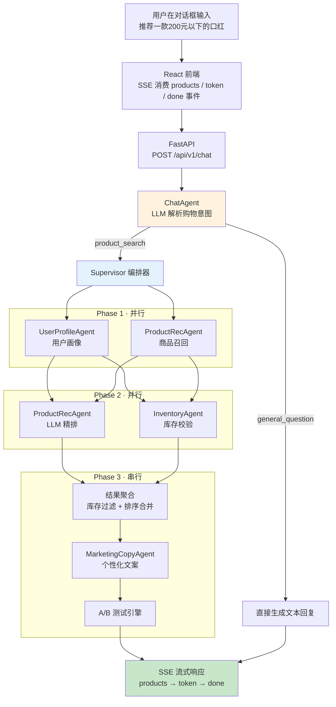

# Multi-Agent E-Commerce System

基于 Multi-Agent 协作的电商导购与推荐系统。Supervisor 编排 5 个专业 Agent，完成「对话意图解析 → 用户画像 → 商品召回 → LLM 精排 → 库存校验 → 文案生成」全流程，后端为 FastAPI，前端为 React，支持 SSE 流式对话。

## 系统架构



除聊天入口外，还提供两个直接调用入口：`POST /api/v1/recommend`（Supervisor 编排）与 `POST /api/v1/recommend/graph`（LangGraph 状态图）。

## 核心 Agent

| Agent | 职责 | 文件 |
|-------|------|------|
| ChatAgent | 解析多轮对话中的购物意图，分流闲聊与购物咨询，委托 Supervisor 推荐 | `python/agents/chat_agent.py` |
| UserProfileAgent | 基于用户行为数据（浏览、购买等）生成结构化画像与 RFM 分群 | `python/agents/user_profile_agent.py` |
| ProductRecAgent | 关键词/类目过滤召回候选商品，再用 LLM 精排出 TopN | `python/agents/product_rec_agent.py` |
| InventoryAgent | 过滤缺货商品，输出库存预警与动态限购策略 | `python/agents/inventory_agent.py` |
| MarketingCopyAgent | 按用户分群选择文案模板生成个性化文案，并做广告法敏感词过滤 | `python/agents/marketing_copy_agent.py` |

### 编排方式

Supervisor 采用「并行分发 + 聚合」模式，按依赖关系分三阶段执行：

1. **Phase 1（并行）**：用户画像 与 商品召回互不依赖，同时执行；
2. **Phase 2（并行）**：画像驱动的 LLM 精排 与 库存校验同时执行；
3. **Phase 3（串行）**：聚合最终商品列表后生成营销文案。

`asyncio.gather()` 使每阶段的耗时约等于最慢 Agent 的耗时，而非相加。

### Agent 基类

所有 Agent 继承 `BaseAgent`，由基类统一提供：

- **超时控制**：每个 Agent 按配置超时，互不影响；
- **指数退避重试**：失败后按 0.5s → 1s → 2s 重试；
- **降级（Fallback）**：重试耗尽后返回降级结果，保证系统不崩溃。

子类只需实现 `_execute()` 方法。

### A/B 测试

`services/ab_test.py` 内置两级能力：

- **一致性哈希分桶**：同一用户始终进入同一实验组；
- **Thompson Sampling**：根据点击反馈更新 Beta 分布，动态向效果更好的实验组倾斜流量。

## 快速开始

### 环境要求

- Python 3.11+
- Node.js 18+（前端）
- 任意 OpenAI 兼容 LLM 接口的 API Key

### 1. 启动后端

```bash
cd python

# 创建独立环境（conda 或 venv 均可）
conda create -n agent python=3.11 -y
conda activate agent

pip install -r requirements.txt
```

### 2. 配置环境变量

```bash
cp .env.example .env
```

编辑 `.env`，至少填写 API Key（接口地址和模型名填写你所用服务的）：

```env
ECOM_LLM_API_KEY=你的API密钥
ECOM_LLM_BASE_URL=https://api.openai.com/v1
ECOM_LLM_MODEL=gpt-4o-mini
```

### 3. 启动服务

```bash
python main.py
```

启动成功后：

- API 服务：http://localhost:8000
- Swagger 文档：http://localhost:8000/docs

### 4. 启动前端

另开一个终端：

```bash
cd frontend
npm install
npm run dev
```

浏览器打开 http://localhost:5173 ，在对话框输入「推荐一款口红」即可体验。

### 5. 运行单元测试

测试不依赖 LLM API，也不需要启动服务：

```bash
cd python
pip install pytest pytest-asyncio
pytest tests/ -v
```

## API 接口

| 方法 | 路径 | 说明 |
| ---- | ---- | ---- |
| GET | `/health` | 健康检查 |
| POST | `/api/v1/recommend` | Supervisor 编排推荐 |
| POST | `/api/v1/recommend/graph` | LangGraph 状态图推荐 |
| POST | `/api/v1/chat` | 聊天式推荐（SSE 流式） |
| GET | `/api/v1/experiments` | A/B 实验状态 |
| GET | `/api/v1/metrics` | 系统监控指标 |
| POST | `/api/v1/experiments/{id}/outcome` | 记录 A/B 测试结果 |

请求示例：

```bash
curl -X POST http://localhost:8000/api/v1/recommend \
  -H "Content-Type: application/json" \
  -d '{"user_id": "user_001", "scene": "homepage", "num_items": 5}'
```

聊天式推荐为 SSE 流式响应，事件顺序为 `products → token(×N) → done`：

```bash
curl -N -X POST http://localhost:8000/api/v1/chat \
  -H "Content-Type: application/json" \
  -d '{"user_id":"U001","messages":[{"role":"user","content":"推荐一款口红"}]}'
```

## 数据说明

系统默认使用内置数据即可完整运行：商品库为 `agents/product_rec_agent.py` 中的 `MOCK_PRODUCTS` 列表（覆盖数码、美妆、服饰、食品等类目，每个商品自带 `stock` 库存字段），用户行为数据可通过请求的 `context` 字段传入。

如需接入真实数据（均已在配置中预留）：

- **Redis 特征服务**：`services/feature_store.py` 实现了基于 Sorted Set 的行为序列存储与 RFM 计算，可注入 `UserProfileAgent.feature_store`；
- **数据库/向量检索**：`config/settings.py` 已预留 `database_url`、`milvus_*` 配置项。

### 修改商品库

直接编辑 `MOCK_PRODUCTS` 列表即可，`stock` 设为 0 的商品会被库存 Agent 自动过滤：

```python
Product(
    product_id="P001",       # 唯一标识
    name="iPhone 16 Pro",    # 商品名
    category="手机",          # 类目（参与召回过滤与画像匹配）
    price=7999,              # 价格
    brand="Apple",           # 品牌
    seller_id="S01",         # 卖家 ID
    stock=500,               # 库存
    tags=["旗舰", "新品"],    # 标签（供 LLM 精排参考）
)
```

## 项目结构

```text
.
├── python/                        # 后端（FastAPI）
│   ├── main.py                    # 入口，定义所有路由
│   ├── agents/                    # 五个 Agent
│   │   ├── base_agent.py          # 基类（超时、重试、降级）
│   │   ├── chat_agent.py          # 聊天意图解析（前置门面）
│   │   ├── user_profile_agent.py  # 用户画像
│   │   ├── product_rec_agent.py   # 商品推荐（含内置商品库）
│   │   ├── inventory_agent.py     # 库存决策
│   │   └── marketing_copy_agent.py# 营销文案
│   ├── orchestrator/
│   │   ├── supervisor.py          # Supervisor 并行编排
│   │   └── graph.py               # LangGraph 状态图实现
│   ├── services/
│   │   ├── ab_test.py             # A/B 测试引擎
│   │   ├── feature_store.py       # Redis 实时特征服务
│   │   └── metrics.py             # 监控指标收集
│   ├── models/schemas.py          # 数据模型
│   ├── config/settings.py         # 配置管理
│   └── tests/                     # 单元测试
├── frontend/                      # 前端（React + Vite）
│   └── src/
│       ├── hooks/useChat.js       # SSE 连接与消息状态
│       └── components/            # 聊天窗口、商品卡片等组件
├── docs/architecture.md           # 架构设计文档
└── docker-compose.yml             # 一键部署（含 Redis/Milvus/MySQL）
```
