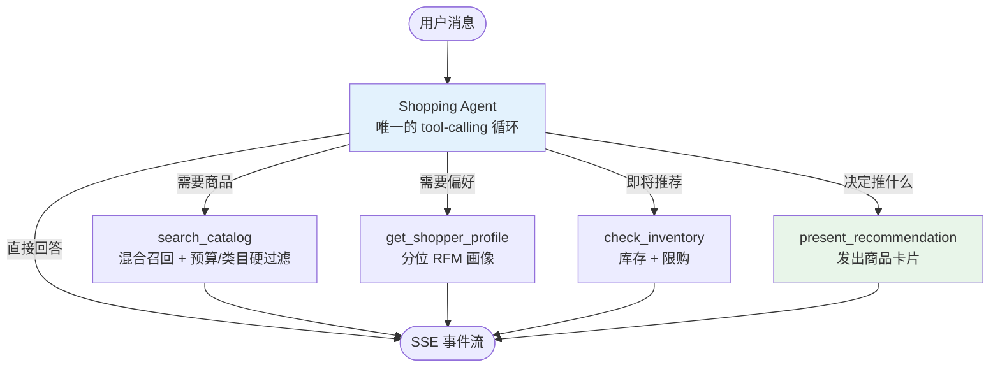

# Agentic Shopping Assistant

[](https://github.com/heheyHazel/Awesome-Agentic-Shopping-Assistant/actions/workflows/ci.yml)

单 Agent + 多工具的电商导购系统：**一个 tool-calling agent** 负责理解需求、改写查询、挑选商品与撰写回复；画像、召回、库存这些它没法凭空知道的东西做成确定性工具。全过程通过 SSE 实时推送，左栏如实展示哪些工具被调用了。后端 FastAPI，前端 React 19 + TypeScript。

<details>
<summary><b>English summary</b></summary>

An interactive shopping agent over the Chinese ShopSimulator catalogue, plus the
harness and post-training pipeline behind it. The point of the repository is that
**the app and the training run share one agent loop**: serving pushes the loop's
events onto an SSE stream, training keeps the `Trajectory` objects instead, so
the model that is being trained is the model being demoed.

Three pieces:

| | |
|---|---|
| **Interactive app** | FastAPI + React 19, one tool-calling loop over 23,421 real Chinese products, hybrid keyword/vector recall, live SSE |
| **Harness** | `src/shoprl/`: loop, deterministic context policy, session memory, tool registry, and backends for OpenAI-compatible endpoints, `transformers` and vLLM |
| **Training stack** | teacher collection → SFT → on-policy GRPO on verifiable rewards, with OPD / OPSD / RLSD distillation terms, and evaluation against the official ShopSimulator split |

What the audit found, all measured rather than assumed:

- the release holds **23,421 tasks** and its row order *is* the task id space; the
  previous converter kept only the product half and dropped every task and SKU
  option, so nothing could be trained on;
- the environment's ceiling is **95.2 %** `r_hard`, because upstream rewrites `/`
  to a pipe in clickable option values but keeps the raw string in the goal, so a
  handful of tasks cannot score;
- `r_type` and `r_price` are constant at 1 on this data, so the reward actually
  being optimised is `r_att · r_option`.

One card is enough: 1.7B fine-tunes at full precision in 24 GB with 8-bit Adam,
GRPO uses LoRA with the frozen base as its own reference, and the rollout width
decides whether a step takes minutes or tens of minutes.

Start here: [`docs/training.md`](docs/training.md) for the pipeline and the
memory arithmetic, [`docs/harness.md`](docs/harness.md) for what was taken from
the Pi/Slime reference and what was replaced,
[`docs/data-audit.md`](docs/data-audit.md) for the numbers above.

CI runs the whole suite plus a real HTTP conversation against a canned model, so
a fresh clone with no GPU, no API key and no checkpoint still verifies itself.

```bash
pip install -e ".[dev]" && pytest -q        # 117 tests, ~40 s, no GPU
python scripts/setup.py                     # fetch the catalogue
python -m shopping_assistant                # http://localhost:8000
```

</details>

## 亮点

- **只有一次 LLM 循环**：意图判断、query 改写、选品、写文案全部在同一个 tool-calling agent 里完成，不再有 supervisor → 子 Agent 的固定流水线
- **通用问答只花 1 次 LLM 调用**（不调工具直接答）；购物咨询 2–4 次（工具轮 + 写答案），取决于模型自己决定查多少
- **工具是确定性的**：模型决定查什么、推什么，但召回、库存校验、预算硬过滤都是代码；**UI 上的商品卡片只来自工具的真实返回**，不会随模型的措辞漂移
- **混合召回**：关键词召回 + **本地 ONNX 语义向量召回**（`bge-small-zh-v1.5`，用 RRF 融合）。无需 torch（约 2 GB）、无需 embedding API，完全离线；实测「夏天穿的连衣裙」「卧室香薰」这类自然语言都能命中
- **硬约束不妥协**：预算 / 类目 / 品牌是过滤器，**永不为了让列表非空而放宽**；确实无合适商品时由排序模型返回空列表，前端提示「没有符合条件的商品」
- **意图由模型自己判断**：购物咨询就去调工具，闲聊就直接答——没有单独的意图分类调用，所以通用问答只花 1 次 LLM 调用
- **全程实时流**：Agent 状态、商品卡片、库存、逐字回复都以事件流推送，前端三栏同步刷新
- **对话记忆**：按 `thread_id` 保存对话记录 + 记忆笔记（模型可用 `save_note` 记下预算、颜色这类硬约束，且不会被上下文裁剪剪掉），支持「便宜点的」「那白色的呢」这类追问
- **跨服务商的结构化输出**：`JsonStructured`（JSON 模式 + schema 注入），同时兼容 OpenAI 与 DeepSeek thinking 模型
- **稳健性**：每个 Agent 独立超时熔断、指数退避重试、失败降级（排序挂了就按召回顺序继续）；硬约束（预算/类目）永不为了让列表非空而放宽
- **A/B 测试**：一致性哈希分桶 + Thompson Sampling 动态调权
- **中英双语**：右上角一键切换，界面文案、商品类目/标签、LLM 回复语言同步切换；支持 `?lang=zh` 链接直达

## 界面布局

三栏实时仪表盘：

| 区域 | 内容 |
|------|------|
| 左栏 | 5 张工具卡片（购物 Agent + 4 个工具，空闲 / 运行中 / 完成） |
| 中栏 | 对话流：商品卡片（Best Match / High Rated / Great Value）、库存徽章、逐字流式推荐语；底部输入框 + SSE 连接状态 |
| 右栏 | 用户画像（VIP、RFM Segment、R/F/M 数值）、RFM 客群聚类、A/B 实验面板（转化率 + Winner）、响应耗时（含各 Agent 分解） |

## 系统架构



### 为什么不拆成多 Agent

实测这份目录上，确定性阶段（画像 0.2ms、召回 10ms、库存 0.9ms）比一次 LLM 调用快 3~4 个数量级，而且它们之间**没有真正的并行度**（旧版把 `rerank ∥ inventory` 并起来，但 inventory 只耗时 0.9ms，等于没并）。所以拆成多个 Agent 只增加往返次数与状态维护，不换任何东西。

**一个反面教训**：旧版把「写推荐语」单独做成一个 Agent，结果它和最终总结在写同一段话，用户看到两个气泡说同一件事。现在文案就是最终回答本身。

> 工具返回的结果同时是「给模型看的文本」与「给 UI 用的数据」。如果让 UI 渲染模型措辞里的商品，用户说「200 元以内」就可能在卡片上看到超预算的东西——所以卡片只从 `search_catalog` / `present_recommendation` 的真实返回里取。

## 工具一览

| 工具 | 类型 | 职责 | 实现 |
|------|------|------|------|
| `search_catalog` | 确定性 | 混合召回（关键词 + 向量 RRF），预算/类目硬过滤，永不返回售罄商品 | `retrieval/recall.py` |
| `get_shopper_profile` | 确定性 | 分位 RFM 客群、类目偏好、常购价位 | `domain/rfm.py` |
| `check_inventory` | 确定性 | 实时库存、低库存预警、限购策略 | `domain/inventory.py` |
| `present_recommendation` | 确定性 | 把 Agent 选定的商品作为卡片发出（上限 3 张） | `agent/tools.py` |

意图判断与 query 改写不占独立工具——模型在填工具参数时自然完成；选品与文案在它写最终回答时完成。四个工具在 `agent/tools.py` 里声明成 `ToolSpec`（函数 + JSON Schema），循环在 `agent/shopping_agent.py`，循环本身来自 `shoprl/harness/`。

## 快速开始

### 环境要求

- Python 3.12+
- Node.js 20+（前端开发时需要；若只想跑构建好的页面则不需要）
- 任意 OpenAI 兼容 LLM 接口的 API Key

```bash
pip install -e ".[dev]"      # 安装为可编辑包，含 pytest
cp .env.example .env
# 编辑 .env，填入 API Key / 服务地址 / 模型名
```

### 1. 准备数据（一条命令）

```bash
python scripts/setup.py
```

这一步会下载 ShopSimulator 中文商品库并建立语义召回索引。**它会自动跳过已完成的部分**，
随时可以重跑：

```bash
python scripts/setup.py --check      # 只报告当前有什么，不联网
python scripts/setup.py --catalog    # 只拉商品库
python scripts/setup.py --index      # 只建索引
```

> **关于网络**：数据与模型都托管在境外（Hugging Face / jsDelivr），国内需要镜像。脚本已经处理了这件事：
> 多个镜像轮询、断点续传、以及**校验文件大小后才发现截断则拒绝转换**。若确实全部镜像都不可用，
> 它会明确告诉你哪一步失败、以及重跑哪条命令——**不会**悄悄给你一份残缺的数据。

#### 两种数据模式（很重要）

跳过上面这步也能跑，但那是**降级模式**，功能差别很大：

| | 不跑 setup（默认回落） | 跑过 setup 之后 |
|---|---|---|
| 商品 | **32 件手写演示数据** | **23,315 件真实中文商品**，9 个类目 |
| 用户 | 4 个 | **4,009 个**（含 RFM 画像） |
| 召回方式 | **只有关键词匹配**，语义召回失效 | 关键词 + 语义向量混合召回 |
| 适合 | 单纯看界面与流程 | 真实体验推荐质量 |

`python scripts/setup.py --check` 会明确告诉你当前处在哪一种。

### 2. 启动

前端有**开发**和**单进程**两种跑法，按需要选一种。

**开发模式**（改前端时用，有热更新，两个进程）：

```bash
cd frontend && npm install && npm run dev    # http://localhost:5173，/api 自动代理到 8000
python -m shopping_assistant                 # 另一个终端
```

**单进程模式**（只有一个后端进程，把前端打进 `frontend/dist` 后由 FastAPI 同源托管）：

```bash
cd frontend && npm install && npm run build   # 产出 frontend/dist/
python -m shopping_assistant                  # http://localhost:8000 就是完整页面
```

`frontend/dist/` **不进版本库**（构建产物不入库是通行做法），所以 clone 之后需要自己 build 一次。
未 build 时后端会打日志提示并只提供 API：http://localhost:8000/docs 。

### 4. 测试

110 个测试，全部不需要 API Key、不需要 GPU（固定跑内置演示数据，与 `data/` 是否存在无关）：

```bash
pytest -q
```

## API

| 方法 | 路径 | 说明 |
|------|------|------|
| GET | `/health` | 健康检查 |
| POST | `/api/v1/chat` | 聊天入口，SSE 事件流（`language`: `en` \| `zh`） |
| POST | `/api/v1/recommend` | 非流式推荐（Swagger / API 客户端） |
| GET | `/api/v1/users` | 演示用户列表 |
| GET | `/api/v1/users/{user_id}/profile` | 用户画像 + RFM |
| GET | `/api/v1/experiments?user_id=` | A/B 实验状态 |
| POST | `/api/v1/experiments/outcome` | 记录实验转化（更新 Thompson 后验） |

### SSE 事件

| 事件 | 载荷 | 前端表现 |
|------|------|----------|
| `session` | `thread_id` | 保存会话，后续追问复用 |
| `experiment` | `variant`, `variants[]`, `winner` | 右栏 A/B 面板 |
| `tool` | `tool`, `status`, `message` | 左栏工具卡片状态灯 |
| `profile` | 用户画像对象 | 右栏画像 + RFM 面板 |
| `products` | 商品列表 | 商品卡片（自动打徽章） |
| `inventory` | 库存条目 + 摘要 | 库存气泡 + 库存徽章 |
| `token` | `content` | 逐字流式回复 |
| `done` | `latency_ms`, `timings` | 响应耗时卡片（按工具分解） |
| `error` | `message` | 错误气泡 |
| `context` | `tokens` | 本轮发给模型的上下文 token 数（前端暂未消费，可用于上下文占用指示） |
| `trajectory` | `termination`, `reward` | 本轮的终止原因与奖励（前端暂未消费，调试用；与训练侧记录的是同一个 `Trajectory`） |

最后两个事件由 `shoprl.harness` 的循环直接发出，是前后端共用同一个循环的结果：训练侧读 `Trajectory` 对象，服务侧把它压成两个事件。

## 配置

`.env`（前缀 `ECOM_`）：

| 变量 | 默认值 | 说明 |
|------|--------|------|
| `ECOM_LLM_API_KEY` | — | 必填 |
| `ECOM_LLM_BASE_URL` | `https://api.openai.com/v1` | 任意 OpenAI 兼容地址 |
| `ECOM_LLM_MODEL` | `gpt-4o-mini` | 模型名 |
| `ECOM_LLM_DISABLE_THINKING` | `false` | DeepSeek thinking 模型建议开启 |
| `ECOM_MAX_PRODUCTS` | `3` | 聚合后展示的商品数 |
| `ECOM_MAX_CANDIDATES` | `12` | 召回候选上限 |
| `ECOM_DATA_SOURCE` | `auto` | `auto` / `real` / `mock`，见下方「数据来源」 |
| `ECOM_CURRENCY` | `CNY` | 目录货币（ISO 代码），同时驱动界面价格符号与提示词 |

每一轮都会产出完整的 `Trajectory`（含每个 step 实际发给模型的 prompt、工具返回、耗时与终止原因），需要排查时直接看它即可。

## 项目结构

```text
.
├── pyproject.toml                  # 依赖 / pytest / ruff 配置
├── src/shopping_assistant/         # 后端源码（src 布局，可安装为包）
│   ├── settings.py                 # 配置（含 data_dir）
│   ├── api/app.py                  # FastAPI：路由 + SSE + 托管前端
│   ├── agent/
│   │   ├── shopping_agent.py       # 唯一的 tool-calling agent
│   │   ├── tools.py                # 4 个确定性工具
│   │   └── prompts.py              # system prompt 与语言规则
│   ├── domain/                     # 纯业务规则，无 I/O
│   │   ├── models.py               # Pydantic 模型
│   │   ├── rfm.py                  # 分位 RFM 客群
│   │   ├── inventory.py            # 库存与限购
│   │   └── currency.py
│   ├── retrieval/                  # 召回层
│   │   ├── recall.py               # 硬过滤 + 关键词/向量 + RRF
│   │   ├── embeddings.py           # 本地 ONNX 向量（多镜像下载）
│   │   └── index.py                # 向量索引与检索
│   ├── catalog/                    # 商品与用户读取（真实↔演示）
│   └── services/                   # llm / structured / ab_test / events
│
├── src/shoprl/                     # 可训练 agent 内核（无 Web 依赖，可与服务端共用）
│   ├── harness/                    # 循环 / 上下文策略 / 记忆 / 工具注册表 / 模型后端
│   ├── env/                        # ShopSimulator：商品库 / BM25 检索 / 会话 / 奖励 / 任务池
│   ├── data/                       # 教师轨迹采集 + turn 级 SFT 数据（含 loss mask）
│   ├── train/                      # rollout 引擎 / SFT / GRPO(RLVR) / OPD 蒸馏
│   ├── eval/                       # rollout 评测 + 官方指标
│   └── cli.py                      # python -m shoprl.cli <stage>
│
├── tests/                          # 110 个测试，按包结构对齐
│   ├── test_api.py                 # HTTP 层
│   ├── test_agent_tools.py         # 4 个工具
│   ├── test_domain.py              # RFM / 库存 / 货币
│   ├── test_retrieval.py           # 召回与融合
│   ├── test_ab_test.py
│   └── test_shoprl_*.py            # 环境语义 / harness 不变量 / loss mask / 任务池
│
├── frontend/                       # React 19 + TS + Tailwind
│   └── dist/                       # 构建产物，由后端托管
│
├── scripts/                        # 环境与数据脚本（不属于服务运行时）
│   ├── setup.py                    # 一条命令：拉数据 + 建索引
│   ├── fetch_data.py
│   └── build_index.py
│
├── data/                           # 数据产物（gitignore）
│   ├── raw/                        # 下载的原始文件
│   └── generated/                  # catalog.json / shoppers.json / embeddings.npy
│
├── models/                         # 模型权重（gitignore）
│   └── bge-small-zh-v1.5/          # 本地 ONNX 向量模型，约 24 MB
│
├── configs/                        # 训练配置（JSON）+ CLI 逐字段覆盖
├── training/                       # 训练入口脚本（每阶段一个，带硬件预设）
├── plan/                           # 计划与决策文档
└── docs/                           # architecture / data-audit / harness / training
```

## 数据来源

### 真实数据（推荐）

```bash
python scripts/fetch_data.py                 # 完整库 23,421 条，约 24 MB，镜像自动回退
python scripts/fetch_data.py --source hf     # 强制走 HF（同一份数据，~104 MB jsonl）
```

自 [ShopSimulator](https://github.com/ShopAgent-Team/ShopSimulator)（arXiv 2601.18225）转换而来。上游把同一份目录打成两种包：环境仓库里是 24 MB 的 gz 数组，HF 上是 104 MB 的 JSON Lines，**内容相同**（实测都是 23,421 条记录）。

- **商品**：真实中文电商商品（标题、三级类目、店铺、CNY 价格、属性标签、SKU、图片 URL），9 个一级类目，23,315 件通过价格清洗
- **用户**：其中 4,666 条带 `user_persona`（4,009 个唯一用户），含会员等级、近 90 天订单数、近 30 天消费额、复购率、类目/品牌偏好、价格区间、14 天搜索词与收藏加购记录

> 只要 persona 分片（4,638 件商品）的话，用它当 `--files` 即可，但那些记录本来就是完整库的子集，没有理由这么取。

上游数据集**没有 license**，因此数据不入库：`data/` 与 `models/` 已在 `.gitignore` 中，clone 后执行 `python scripts/setup.py`。

商品缺少评分、评价数与库存，这三项由 asin 的确定性哈希**合成**（保证同商品永远同值），代码中标注为 SYNTHETIC；`recency_days` 同样由复购率推导，因数据集不含「距上次购买天数」。

## 语义召回

```bash
python scripts/setup.py                   # 一条命令完成下载 + 建索引（23315 件编码约 67s）
```

- 模型：`BAAI/bge-small-zh-v1.5` 的 int8 ONNX 版本，跑在 `onnxruntime` 上——**不需要 torch**，也不需要 embedding API
- 索引：`data/generated/embeddings.npy`（512 维，L2 归一化，点积即余弦）；文件被 gitignore，模型权重在 `models/`
- 检索：关键词与向量两路各自排序，用 **RRF** 融合（比标定「关键词分」与「余弦相似度」的权重稳得多）
- 约束：硬过滤先算好合规商品集合，**向量检索与排序都只在该集合内进行**（子集矩阵乘，所以预算/类目越窄越快），最后在 `recall_products` 出口再校验一次
- 降级：索引缺失、商品目录变化（id 对不上）或模型未下载时，自动回落纯关键词召回，不会报错
- 速度：召回中位 **7–9 ms**（带预算/类目过滤时）到 34 ms（全库无过滤），相对秒级的 LLM 调用可忽略

### 一个实测无效的做法

本来想用「余弦相似度低于阈值就算无匹配」，在真实目录上标定后发现**不可行**：应命中的查询 top-1 最低 0.600，应不命中的最高 0.602，两类几乎完全重叠；换成相对分布（z 分数）也一样（3.85–4.84 vs 3.02–5.39）。所以没有采用相似度阈值，而是让排序模型在候选都不合适时返回空列表——已实测生效（「想买一双 1 元以内的跑鞋」「我要买一架私人飞机」都正确判空）。

### 内置演示数据（回落）

未执行下载脚本时自动使用，保证仓库 clone 后可立即运行：

- `data/users.py`：4 位演示用户（Champions / New / Loyal / At Risk 四个客群）
- `data/products.py`：32 件商品（14 个类目，CNY 价格，含评分与库存）

`ECOM_DATA_SOURCE` 控制选择：`auto`（默认，有真实数据则用真实数据）／`real`（缺失时启动即报错）／`mock`（强制内置，测试使用）。

调库与选数逻辑集中在 `catalog/store.py`，其余代码只依赖 `from shopping_assistant.catalog import PRODUCTS, USERS`。

A/B 面板预置 499 / 498 次实验样本（A 62.7% vs B 74.3%），可直接观察 Thompson Sampling 的获胜方。

## 训练子系统（shoprl）

上面这套界面是**产品**；`src/shoprl/` 是**可训练的内核**：同一个 agent 循环既服务于前端，
也用来产出训练数据，所以「演示里的 agent」和「训练出来的 agent」不会走偏。

```text
ShopSimulator 原始数据 ──► 商品库 + 任务池 ──► 教师轨迹采集 ──► SFT ──► 在线 GRPO(RLVR)
                                              （可叠加 OPD / OPSD / RLSD 蒸馏项）
                                                                          └──► official_test 评测
```

一条命令一个阶段，全部在 `python -m shoprl.cli` 下：

```bash
python -m shoprl.cli catalogue      # 原始数据 → 商品库（含 SKU 选项与价格）
python -m shoprl.cli tasks          # 任务池：official_test / dev / sft / rl
bash training/scripts/01_collect_teacher.sh   # 教师轨迹（需一个 API）
bash training/scripts/02_prepare_sft.sh       # turn 级 SFT 数据（带真实 loss mask）
bash training/scripts/03_train_sft.sh         # SFT（PRESET=4090 / 4090-lora / rtx6000 / smoke）
bash training/scripts/04_train_grpo.sh        # GRPO + RLVR（DISTILL=1 叠加蒸馏）
bash training/scripts/05_eval.sh              # official_test 上的单次 rollout 评测
```

几个已经用实测数字确认的结论（详见 [docs/data-audit.md](docs/data-audit.md)）：

- 原始发布里 **23,421 条任务**，行序就是 task id；旧的数据管线只保留了商品，**任务和 SKU 选项全部被丢掉**，
  所以此前这个仓库无法训练；
- 边车文件 `fine_items_train_persona.jsonl` 第一次下载时**被截断**（3,323 条只拿到 1,603 条），
  已重新拉取并校验通过（3,323 条、0 条损坏、2,841 个 persona）；主数据文件自始至终完好；
- 用「知道答案」的 oracle 跑评测集，`r_hard` 上限只有 **95.2 %**：约 5 % 的任务因上游把选项值里的
  `/` 改写为 ` | ` 而无法得分。任何模型的分数都受这个上限约束；
- `r_type` 与 `r_price` 在这份数据上**恒为 1**（记录里没有 `query` 字段；价格上限总是高于目标商品价格），
  真正在优化的只有 `r_att · r_option`。

单卡可行性：1.7B 在 24 GB 上可以全参 SFT（8-bit Adam + 梯度检查点），GRPO 用 LoRA 且
**直接用基座权重当 reference**（`disable_adapter()`）省掉第二份模型；4B 建议 LoRA/QLoRA，
8B 只走 QLoRA。参考项目那套 Megatron + SGLang + Pi CLI 的单卡配置**不适用**，
原因和取舍写在 [docs/harness.md](docs/harness.md)。

## 许可与数据

- **代码**：[MIT License](LICENSE) —— `Copyright (c) 2026 heyheyHazel`
- **数据**：本仓库**不包含**也不重新分发 ShopSimulator 数据集（含 `data/raw/`、`data/generated/`，均已 gitignore），仅提供下载转换脚本；运行时下载的数据遵循上游条款，不在 MIT 授权范围内

## 设计说明

- **结构化输出**：部分服务商（如 DeepSeek thinking 模型）不支持强制 `tool_choice` 或不支持 `json_schema` 响应格式，因此 `JsonStructured` 采用 JSON 模式 + 在 prompt 中注入 JSON Schema 的方式，兼容性最好
- **前端流式**：未使用第三方聊天 SDK，而是自定义强类型 SSE Hook——事件包含 Agent 状态、画像、A/B 等业务数据，直连自定义协议比适配通用 SDK 更简单可靠
- **降级优先**：任何 LLM 环节失败都不会中断整轮对话，重排失败按召回顺序返回，文案失败则跳过该气泡
- **多语言**：前端负责全部界面文案（词典 + 类目/标签/客群映射），后端只根据请求中的 `language` 字段给各 LLM 输出注入语言指令；检索词语言由实际加载的商品目录决定（`catalog_language_rule` 依据类目是否含中文判断），调度 Agent 在需要时做翻译
