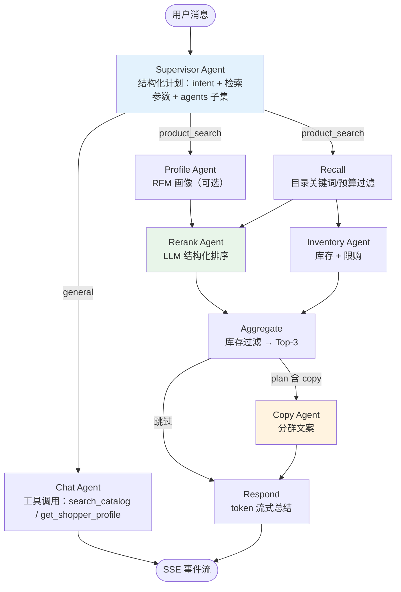

# Multi-Agent Shopping Assistant

基于 **LangGraph** 的多 Agent 电商导购系统：Supervisor 用 LLM 动态规划每个请求要跑哪些 Agent，画像、召回、重排、库存、文案各司其职，全部过程通过 SSE 实时推送到前端仪表盘。后端 FastAPI，前端 React 19 + TypeScript。

## 亮点

- **Supervisor 动态调度**：LLM 输出结构化执行计划（意图 + 检索参数 + 要运行的 Agent 子集），简单问题跳过画像/文案等阶段，不是写死的流水线
- **并行流水线**：`画像 ∥ 召回 → LLM 重排 ∥ 库存校验 → 聚合 → 文案 → 流式总结`，LangGraph 原生扇出/汇合
- **全程实时流**：Agent 状态、商品卡片、文案、库存、逐字回复都以事件流推送，前端三栏同步刷新
- **对话记忆**：LangGraph Checkpointer 按 `thread_id` 保存上下文，支持「便宜点的」「那白色的呢」这类追问
- **工具调用**：通用问答复用一个 tool-calling Agent（`search_catalog` / `get_shopper_profile`），回答基于真实目录数据
- **跨服务商的结构化输出**：`JsonStructured`（JSON 模式 + schema 注入），同时兼容 OpenAI 与 DeepSeek thinking 模型
- **稳健性**：每个 Agent 独立超时熔断、指数退避重试、失败降级（重排挂了就按召回顺序继续）
- **A/B 测试**：一致性哈希分桶 + Thompson Sampling 动态调权
- **中英双语**：右上角一键切换，界面文案、商品类目/标签、LLM 回复语言同步切换；支持 `?lang=zh` 链接直达

## 界面布局

三栏实时仪表盘：

| 区域 | 内容 |
|------|------|
| 左栏 | 4 个 Agent 状态卡片（空闲 / 运行中 / 完成）+ 技术栈 |
| 中栏 | 对话流：Supervisor 回复、商品卡片（Best Match / High Rated / Great Value）、文案、库存徽章、逐字流式总结；底部输入框 + SSE 连接状态 |
| 右栏 | 用户画像（VIP、RFM Segment、R/F/M 数值）、RFM 客群聚类、A/B 实验面板（转化率 + Winner）、响应耗时（含各 Agent 分解） |

## 系统架构



## Agent 一览

| Agent | 类型 | 职责 | 实现 |
|-------|------|------|------|
| `SupervisorAgent` | LLM 结构化输出 | 意图路由 + 动态调度计划 | `agents/supervisor_agent.py` |
| `UserProfileAgent` | 确定性计算 | RFM 打分 + 客群分类 | `agents/user_profile_agent.py` |
| `ProductRecAgent` | 规则 + LLM | 目录召回 + LLM 重排 | `agents/product_rec_agent.py` |
| `InventoryAgent` | 确定性计算 | 缺货过滤、低库存预警、限购 | `agents/inventory_agent.py` |
| `MarketingCopyAgent` | LLM 结构化输出 | 按客群生成商品文案 | `agents/marketing_copy_agent.py` |
| `ChatAgent` | LLM 工具调用 | 通用问答（目录/画像工具） | `agents/chat_agent.py` |

## 快速开始

### 环境要求

- Python 3.12+
- Node.js 20+
- 任意 OpenAI 兼容 LLM 接口的 API Key

### 1. 后端

```bash
cd python

conda create -n agent python=3.12 -y
conda activate agent
pip install -r requirements-dev.txt   # 含 pytest

cp .env.example .env
# 编辑 .env，填入 API Key / 服务地址 / 模型名

# 拉取 ShopSimulator 真实商品与用户画像（约 27 MB，未执行则自动回落内置演示数据）
python scripts/fetch_data.py

python main.py                        # http://localhost:8000
```

> **DeepSeek 用户**：thinking 模型会拖慢结构化调用（实测 10s → 1.4s）且不支持强制 tool_choice，
> 请在 `.env` 中设置 `ECOM_LLM_DISABLE_THINKING=true`，项目会自动关闭隐藏推理。

### 2. 前端

```bash
cd frontend
npm install
npm run dev                           # http://localhost:5173
```

浏览器打开 http://localhost:5173 ，试试输入 `推荐一款 300 元以内的保湿护肤品`。

### 3. 测试

16 个单元测试与集成测试全部使用桩 LLM，不需要 API Key（固定跑内置演示数据）：

```bash
cd python
pytest tests/ -v
```

### 4. Docker

```bash
export ECOM_LLM_API_KEY=你的密钥
docker compose up -d                  # API: http://localhost:8000
```

## API

| 方法 | 路径 | 说明 |
|------|------|------|
| GET | `/health` | 健康检查 |
| POST | `/api/v1/chat` | 聊天入口，SSE 事件流（`language`: `en` \| `zh`） |
| POST | `/api/v1/recommend` | 非流式推荐（Swagger / API 客户端） |
| GET | `/api/v1/users` | 演示用户列表 |
| GET | `/api/v1/users/{user_id}/profile` | 用户画像 + RFM |
| GET | `/api/v1/experiments?user_id=` | A/B 实验状态 |
| POST | `/api/v1/experiments/outcome` | 记录实验转化（更新 Thompson 后验） |

### SSE 事件

| 事件 | 载荷 | 前端表现 |
|------|------|----------|
| `session` | `thread_id` | 保存会话，后续追问复用 |
| `agent` | `agent`, `status`, `message` | 左栏状态灯 / 聊天内的 Agent 状态 |
| `plan` | `intent`, `reply`, `agents`, … | Supervisor 气泡 + 本轮调度计划 |
| `experiment` | `variant`, `variants[]`, `winner` | 右栏 A/B 面板 |
| `profile` | 用户画像对象 | 右栏画像 + RFM 面板 |
| `products` | 商品列表 | 商品卡片（自动打徽章） |
| `marketing` | 文案条目 + 客群 | Copywriting Agent 气泡 |
| `inventory` | 库存条目 + 摘要 | Inventory Agent 气泡 + 库存徽章 |
| `token` | `content` | 逐字流式回复 |
| `done` | `latency_ms`, `timings` | 响应耗时卡片 |
| `error` | `message` | 错误气泡 |

## 配置

`.env`（前缀 `ECOM_`）：

| 变量 | 默认值 | 说明 |
|------|--------|------|
| `ECOM_LLM_API_KEY` | — | 必填 |
| `ECOM_LLM_BASE_URL` | `https://api.openai.com/v1` | 任意 OpenAI 兼容地址 |
| `ECOM_LLM_MODEL` | `gpt-4o-mini` | 模型名 |
| `ECOM_LLM_DISABLE_THINKING` | `false` | DeepSeek thinking 模型建议开启 |
| `ECOM_MAX_PRODUCTS` | `3` | 聚合后展示的商品数 |
| `ECOM_MAX_CANDIDATES` | `12` | 召回候选上限 |
| `ECOM_DATA_SOURCE` | `auto` | `auto` / `real` / `mock`，见下方「数据来源」 |
| `ECOM_CURRENCY` | `CNY` | 目录货币（ISO 代码），同时驱动界面价格符号与提示词 |

可选接入 LangSmith 追踪：设置 `LANGSMITH_TRACING=true` 与 `LANGSMITH_API_KEY`。

## 项目结构

```text
.
├── python/
│   ├── main.py                     # FastAPI 入口 + SSE 适配器
│   ├── orchestrator/graph.py       # LangGraph 状态图（核心编排）
│   ├── agents/
│   │   ├── supervisor_agent.py     # LLM 计划与路由
│   │   ├── user_profile_agent.py   # RFM 画像
│   │   ├── product_rec_agent.py    # 召回 + LLM 重排
│   │   ├── inventory_agent.py      # 库存决策
│   │   ├── marketing_copy_agent.py # 分群文案
│   │   ├── chat_agent.py           # 工具调用助手
│   │   ├── structured.py           # 跨服务商结构化输出
│   │   ├── models.py               # ChatOpenAI 工厂
│   │   └── base_agent.py           # 超时 / 重试 / 降级基类
│   ├── data/                       # 演示商品目录与用户
│   ├── services/ab_test.py         # A/B + Thompson Sampling
│   ├── models/schemas.py           # Pydantic 模型
│   ├── config/settings.py          # 环境配置
│   └── tests/                      # 15 个测试（桩 LLM）
├── frontend/
│   └── src/
│       ├── hooks/useAgentStream.ts # SSE 连接与全局状态
│       ├── components/             # 三栏布局的所有组件
│       ├── api.ts, types.ts
│       └── index.css               # Tailwind 主题
├── docs/architecture.md            # 架构与协议详解
└── docker-compose.yml
```

## 数据来源

### 真实数据（推荐）

```bash
cd python
python scripts/fetch_data.py                 # HF 镜像，两个 persona 分片
python scripts/fetch_data.py --source cdn    # 备用源：jsDelivr 上的单个 gz 文件
```

自 [ShopSimulator](https://github.com/ShopAgent-Team/ShopSimulator)（arXiv 2601.18225）转换而来：

- **商品**：真实中文电商商品（标题、三级类目、店铺、CNY 价格、属性标签、SKU、图片 URL），9 个一级类目
- **用户**：每条商品自带 `user_persona`，含会员等级、近 90 天订单数、近 30 天消费额、复购率、类目/品牌偏好、价格区间、14 天搜索词与收藏加购记录

上游数据集**没有 license**，因此数据不入库：`python/data/raw/` 与 `python/data/generated/` 已在 `.gitignore` 中，clone 后需自行执行脚本。

商品缺少评分、评价数与库存，这三项由 asin 的确定性哈希**合成**（保证同商品永远同值），代码中标注为 SYNTHETIC；`recency_days` 同样由复购率推导，因数据集不含「距上次购买天数」。

### 内置演示数据（回落）

未执行下载脚本时自动使用，保证仓库 clone 后可立即运行：

- `data/users.py`：4 位演示用户（Champions / New / Loyal / At Risk 四个客群）
- `data/products.py`：32 件商品（14 个类目，CNY 价格，含评分与库存）

`ECOM_DATA_SOURCE` 控制选择：`auto`（默认，有真实数据则用真实数据）／`real`（缺失时启动即报错）／`mock`（强制内置，测试使用）。

调库与选数逻辑集中在 `data/store.py`，其余代码只依赖 `from data import PRODUCTS, USERS, get_user`。

A/B 面板预置 499 / 498 次实验样本（A 62.7% vs B 74.3%），可直接观察 Thompson Sampling 的获胜方。

## 许可与数据

- **代码**：[MIT License](LICENSE) —— `Copyright (c) 2026 heyheyHazel`
- **数据**：本仓库**不包含**也不重新分发 ShopSimulator 数据集（含 `data/raw/`、`data/generated/`，均已 gitignore），仅提供下载转换脚本；运行时下载的数据遵循上游条款，不在 MIT 授权范围内

## 设计说明

- **结构化输出**：部分服务商（如 DeepSeek thinking 模型）不支持强制 `tool_choice` 或不支持 `json_schema` 响应格式，因此 `JsonStructured` 采用 JSON 模式 + 在 prompt 中注入 JSON Schema 的方式，兼容性最好
- **前端流式**：未使用第三方聊天 SDK，而是自定义强类型 SSE Hook——事件包含 Agent 状态、画像、A/B 等业务数据，直连自定义协议比适配通用 SDK 更简单可靠
- **降级优先**：任何 LLM 环节失败都不会中断整轮对话，重排失败按召回顺序返回，文案失败则跳过该气泡
- **多语言**：前端负责全部界面文案（词典 + 类目/标签/客群映射），后端只根据请求中的 `language` 字段给各 LLM 输出注入语言指令；检索词语言由实际加载的商品目录决定（`catalog_language_rule` 依据类目是否含中文判断），调度 Agent 在需要时做翻译
